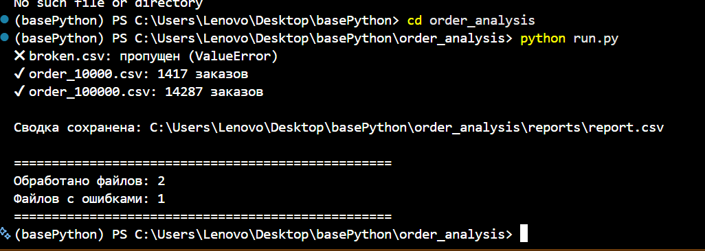

# Важно. На гит не запушены результаты (логи, ответы, цсв файлы с кегла(в дате только сломанный файл))

Достаточно клонировать проект себе, создать окружение\зависимости и пробросить данные в дату. 

В ветке with-data уже с отчетом. Проверить можно ее.

Пакетный анализ данных о заказах интернет-магазина. Скрипт проходит по всем CSV-файлам в папке `data/`, фильтрует доставленные заказы, считает метрики и сохраняет сводный отчёт.

## Что делает

Для каждого CSV-файла в `data/`:
- Читает данные (`pandas`).
- Фильтрует заказы со статусом `Delivered`.
- Считает три метрики:
  - **общая выручка** — сумма `total_amount`,
  - **средний чек** — среднее `total_amount`,
  - **количество заказов**.
- Пропускает повреждённые, пустые и неверные по формату файлы (записывает ошибку в лог и продолжает).
- Сохраняет результат по всем файлам в один CSV.
_____________________________

## Формат входных данных

Каждый CSV содержит заказы со следующими полями:

| Поле | Описание | Пример |
|---|---|---|
| `order_id` | Уникальный номер заказа | `1`, `2003` |
| `person_id` | ID покупателя | `100`, `5000` |
| `order_date` | Дата создания (YYYY-MM-DD) | `2021-03-15` |
| `status` | Статус заказа | `Delivered`, `Shipped`, `Cancelled` |
| `total_amount` | Сумма заказа | `24.99`, `599.95` |
| `currency` | Код валюты | `USD`, `EUR`, `GBP` |
| `payment_method` | Способ оплаты | `credit_card`, `paypal` |
| `shipping_method` | Способ доставки | `standard`, `express` |
| `notes` | Примечания (~5% заполнено) | — |

Обязательные колонки для обработки: `order_id`, `status`, `total_amount`.

##  Положи в дату цсвшные файлы и настрйо окружение (в дате будет только сломанный файл для првоерки) +  uv pip install -r requirements.txt

Скрипт не падает при:

повреждённых CSV,

пустых файлах,

отсутствующих обязательных колонках,

нечисловых значениях в total_amount.

Такие файлы пропускаются, ошибка пишется в logs/errors.log, обработка остальных продолжается.

## Примечание о валютах. В данных присутствуют три валюты (USD, EUR, GBP). В текущей версии total_amount суммируется без учёта валюты — согласно требованиям задания. Для корректного анализа в продакшене потребовалось бы либо разделение метрик по валютам, либо приведение к единой валюте по курсу.!!!

